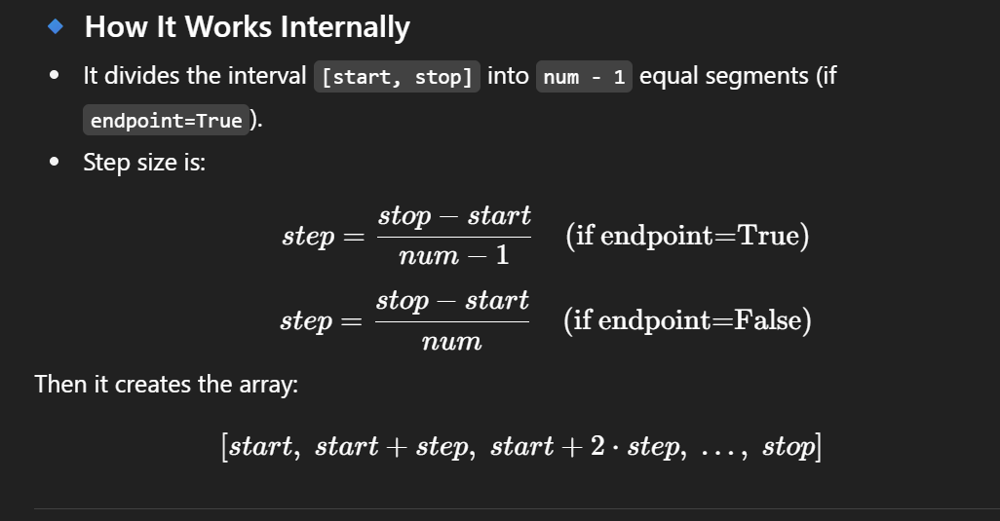

# Table of contents

- [Numpy](#numpy)
- [Data types](#data-types)

---
"**Arrays and Vectorized Computation**" usually refers to how we work with data in **NumPy** (Python’s fundamental package for scientific computing). Let me break it down for you:

---

### 🔹 1. What is an Array?

- An **array** in NumPy is an efficient, multidimensional container for homogeneous data (all elements are of the same type).
    
- Compared to Python lists:
    
    - Arrays are **faster** (because they use contiguous memory blocks in C).
        
    - Arrays are **smaller in memory**.
        
    - Arrays allow **vectorized computation**.
        

Example:

```python
import numpy as np

arr = np.array([1, 2, 3, 4, 5])
print(arr)
```

Output:

```
[1 2 3 4 5]
```

---

### 🔹 2. Vectorized Computation

- Vectorization means performing **operations on entire arrays without explicit Python loops**.
    
- Instead of looping through elements, NumPy applies operations to all elements at once using optimized C code.
    

Example:

```python
arr = np.array([1, 2, 3, 4, 5])

# Scalar operations
print(arr * 2)      # Multiply every element by 2
print(arr + 10)     # Add 10 to every element
print(arr ** 2)     # Square each element

# Array operations
arr2 = np.array([10, 20, 30, 40, 50])
print(arr + arr2)   # Element-wise addition
print(arr * arr2)   # Element-wise multiplication
```

Output:

```
[ 2  4  6  8 10]
[11 12 13 14 15]
[ 1  4  9 16 25]
[11 22 33 44 55]
[ 10  40  90 160 250]
```

---

### 🔹 3. Benefits of Vectorization

- **Speed**: Operations run in compiled C (much faster than Python loops).
    
- **Simplicity**: No need to write loops.
    
- **Readability**: Mathematical formulas look closer to the actual math.
    

---

### 🔹 4. Example: Without vs With Vectorization

Without vectorization (using Python lists):

```python
data = [1, 2, 3, 4, 5]
squares = [x**2 for x in data]
print(squares)
```

With NumPy vectorization:

```python
import numpy as np
arr = np.array([1, 2, 3, 4, 5])
print(arr**2)
```

Both give:

```
[1, 4, 9, 16, 25]
```

But the NumPy version is much faster for large arrays.

---

✅ **In summary**:

- Arrays = NumPy’s fast, memory-efficient data structures.
    
- Vectorized computation = applying operations on whole arrays at once instead of looping.
    
- This is **the core strength of NumPy** and why it’s used in data science, ML, and scientific computing.
    

---
# `NumPy`

## 🔹 What is `ndarray`?

- An **n-dimensional array** object provided by NumPy.
    
- Homogeneous: all elements are of the **same data type** (e.g., all integers, floats, or complex numbers).
    
- Very fast because it is implemented in **C** and uses **contiguous blocks of memory**.
    

---

## 🔹 Creating an `ndarray`

You can create arrays in several ways:

### From a Python list or tuple

```python
import numpy as np

arr1 = np.array([1, 2, 3, 4])         # 1D array
arr2 = np.array([[1, 2], [3, 4]])     # 2D array
print(arr1)
print(arr2)
```

Output:

```
[1 2 3 4]
[[1 2]
 [3 4]]
```

---

## 🔹 Key Attributes of `ndarray`

Every NumPy array has some important attributes:

```python
arr = np.array([[1, 2, 3], [4, 5, 6]])

print(arr.ndim)   # Number of dimensions (axes)
print(arr.shape)  # Shape (rows, columns)
print(arr.size)   # Total number of elements
print(arr.dtype)  # Data type of elements
print(arr.itemsize) # Bytes per element
print(arr.nbytes)   # Total memory used
```

Example Output:

```
2
(2, 3)
6
int64
8
48
```

---

## 🔹 Methods to Create Arrays

NumPy provides many factory functions:

```python
np.zeros((2,3))       # 2x3 array of zeros
np.ones((3,3))        # 3x3 array of ones
np.eye(4)             # 4x4 identity matrix
np.arange(0,10,2)     # Array from 0 to 8 with step 2
np.linspace(0,1,5)    # 5 evenly spaced values from 0 to 1
np.random.rand(2,2)   # 2x2 array of random floats [0,1)
```

#### `linespace` syntax:

```python
numpy.linspace(start, stop, num=50, endpoint=True, retstep=False, dtype=None, axis=0)
```
## 🔹 Parameters Explained

1. **`start`** → The first value in the sequence.
    
2. **`stop`** → The last value in the sequence.
    
3. **`num` (default=50)** → How many values to generate.
    
4. **`endpoint` (default=True)** →
    
    - If `True`: include the `stop` value.
        
    - If `False`: exclude the `stop` value.
        
5. **`retstep` (default=False)** →
    
    - If `True`: returns a tuple `(array, step)` where `step` is the spacing.
        
6. **`dtype`** → Data type of the output array.
    
7. **`axis`** → The axis in the result array to place the samples (useful for higher dimensions).

#### How it works?


Where:
**num** is step.

#### Example

```python
import numpy as np
arr=np.linspace(0,10,5) # By default endpoint is True
# Start: 0
# Stop: 10
# num(step): 5
print(arr)
```

#### Output:

```css
[ 0.   2.5  5.   7.5 10. ]
```

---

## 🔹 Indexing & Slicing

Like Python lists, but more powerful:

```python
arr = np.array([[10, 20, 30], [40, 50, 60]])

print(arr[0, 1])   # Element at row 0, col 1 → 20
print(arr[:, 2])   # All rows, col 2 → [30 60]
print(arr[1, :])   # Row 1 → [40 50 60]
print(arr[0:2, 1:3]) # Subarray → [[20 30], [50 60]]
```

---

## 🔹 Vectorized Operations

```python
arr = np.array([1, 2, 3, 4])

print(arr * 2)     # [2 4 6 8]
print(arr + 5)     # [6 7 8 9]
print(arr ** 2)    # [ 1  4  9 16]
```

---

# Data types

# 🔹 Data Types in NumPy (`dtype`)

- In NumPy, every `ndarray` has a **single, fixed data type** for all its elements.
    
- The data type is stored in the **`dtype` attribute** of the array.
    
- Using a fixed type makes NumPy arrays **faster and more memory-efficient** than Python lists.
    

---

## 🔹 Common NumPy Data Types

| Data Type                             | Description                    |
| ------------------------------------- | ------------------------------ |
| `int8`, `int16`, `int32`, `int64`     | Signed integers (8 to 64 bits) |
| `uint8`, `uint16`, `uint32`, `uint64` | Unsigned integers              |
| `float16`, `float32`, `float64`       | Floating-point numbers         |
| `complex64`, `complex128`             | Complex numbers                |
| `bool`                                | Boolean (True/False)           |
| `object`                              | Arbitrary Python objects       |
| `string_` / `unicode_`                | Fixed-length strings           |

👉 The **default** float type is usually `float64`.

---

## 🔹 Checking the `dtype`

```python
import numpy as np

arr = np.array([1, 2, 3])
print(arr.dtype)   # int64 (depends on system)

arr2 = np.array([1.0, 2.0, 3.0])
print(arr2.dtype)  # float64
```

---

## 🔹 Specifying `dtype` when creating an array

You can explicitly set the data type:

```python
arr = np.array([1, 2, 3], dtype=np.float32)
print(arr, arr.dtype)
```

Output:

```
[1. 2. 3.] float32
```

---

## 🔹 Type Casting (Changing dtype)

NumPy lets you convert an array’s type using `.astype()`:

```python
arr = np.array([1.2, 3.4, 5.6])
int_arr = arr.astype(np.int32)   # Convert to integers
print(int_arr, int_arr.dtype)
```

Output:

```
[1 3 5] int32
```

---

## 🔹 Example: Memory Usage

```python
arr_int = np.array([1, 2, 3], dtype=np.int8)   # 1 byte per element
arr_float = np.array([1, 2, 3], dtype=np.float64) # 8 bytes per element

print(arr_int.itemsize)   # 1
print(arr_float.itemsize) # 8
```

✅ Smaller dtypes = **less memory** but may have **less precision**.

---

## 🔹 Summary

- NumPy arrays (`ndarray`) use **homogeneous data types**.
    
- `dtype` tells you the type of data (int, float, bool, etc.).
    
- You can **specify dtype** when creating arrays or **convert** with `.astype()`.
    
- Choosing the right dtype = balance between **precision and memory usage**.
    

---

# Boolean indexing

## 1. **Boolean Indexing**

Boolean indexing lets you filter arrays based on conditions.

```python
import numpy as np

arr = np.array([10, 20, 30, 40, 50])

# Boolean condition
bool_idx = arr > 25
print("Boolean mask:", bool_idx)  
# [False False  True  True  True]

# Applying mask
filtered = arr[bool_idx]
print("Filtered values:", filtered)  
# [30 40 50]

# Directly
print("Direct condition:", arr[arr % 20 == 0])
# [20 40]
```

👉 **Use case**: Select elements that satisfy certain conditions.

---

## 2. **Transposing Arrays**

Transposing changes the rows into columns and vice versa.

```python
matrix = np.array([[1, 2, 3],
                   [4, 5, 6]])

print("Original:\n", matrix)

# Transpose
transposed = matrix.T
print("Transposed:\n", transposed)

# Equivalent to np.transpose(matrix)
```

👉 **Use case**: Common in linear algebra, machine learning, and data manipulation.

---

## 3. **Swapping Axes**

For multi-dimensional arrays, you can swap specific axes.

```python
arr3d = np.array([[[1, 2], [3, 4]],
                  [[5, 6], [7, 8]]])

print("Original shape:", arr3d.shape)  # (2, 2, 2)

# Swap axes 0 and 2
swapped = np.swapaxes(arr3d, 0, 2)
print("Swapped shape:", swapped.shape)
print(swapped)
```

👉 `np.swapaxes` is more flexible than transpose because you choose exactly which axes to swap.

---

✅ **Summary**:

- **Boolean Indexing** → filtering arrays by condition.
    
- **Transpose (`.T` or `np.transpose`)** → flips rows & columns (or generalizes to all axes).
    
- **Swapaxes (`np.swapaxes`)** → swaps two specific dimensions.
    

---

