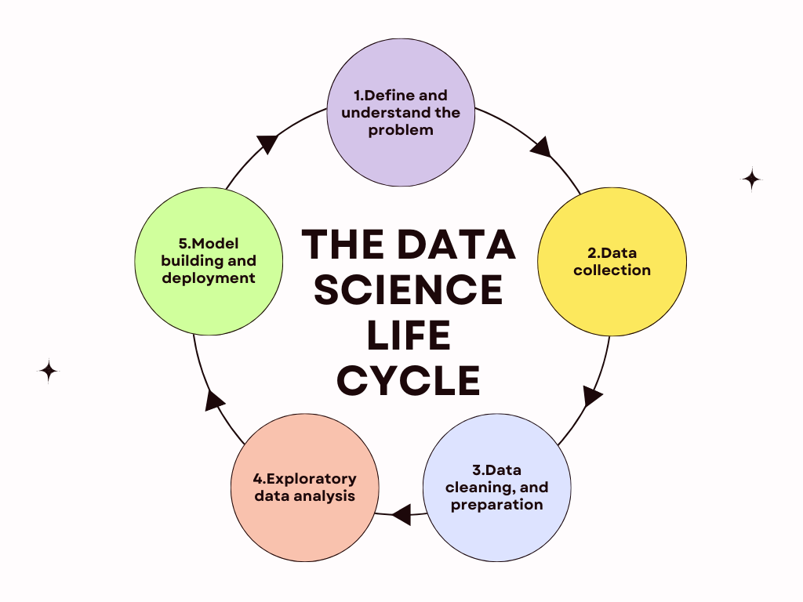

# Table of cotents

- [Evolution of data science](#evolution-of-data-science)
- [Data science life cycle](#data-science-life-cycle)
- [Data science roles](#data-science-roles)
- [Stages in data science roles](#stages-in-data-science-projects)
- [Application of data science](#application-of-data-science)
- [Data security issues](#data-security-issues)
- [Introduction to collection of data](#introduction-to-collection-of-data)
---
# Evolution of data science
## 1. **Early Foundations (Before 1950s)**

- **Statistics & Probability**: Roots trace back to 17th–18th century developments by Pascal, Gauss, Bayes, and others.
    
- **Data Collection**: Census-taking, actuarial science, and early experiments shaped data-driven reasoning.
    
- **Mechanical Computation**: Devices like Charles Babbage’s _Analytical Engine_ and Hollerith’s punch cards (used in the 1890 U.S. census) laid groundwork for automated data handling.
    

---

## 2. **Birth of Modern Computing (1950s–1970s)**

- **Mainframes & Databases**: Rise of electronic computers enabled large-scale calculations.
    
- **Statistical Software**: Early programming languages (FORTRAN, COBOL) supported data analysis.
    
- **Relational Databases (1970)**: Edgar Codd’s relational model transformed how structured data was stored and queried.
    

---

## 3. **Emergence of Data Mining & Business Intelligence (1980s–1990s)**

- **Data Warehousing**: Organizations started storing large volumes of structured business data.
    
- **Business Intelligence (BI)**: Tools for dashboards, reporting, and OLAP (online analytical processing).
    
- **Data Mining**: Machine learning methods (decision trees, clustering, regression) applied to business data.
    

---

## 4. **Big Data Era (2000s)**

- **Explosion of Data**: Internet, mobile devices, and sensors generated massive unstructured data.
    
- **Hadoop & Distributed Computing**: Frameworks enabled storage and parallel processing of big datasets.
    
- **Open Source Tools**: R, Python, and libraries like scikit-learn gained traction.
    
- **Rise of the Data Scientist**: Harvard Business Review (2012) called it “the sexiest job of the 21st century.”
    

---

## 5. **AI & Machine Learning Integration (2010s)**

- **Deep Learning Breakthroughs**: Neural networks excelled in image, speech, and natural language tasks.
    
- **Cloud Platforms**: AWS, Google Cloud, Azure made large-scale computation more accessible.
    
- **Data Ecosystem Growth**: Spark, TensorFlow, PyTorch, and scalable analytics tools matured.
    
- **Cross-Disciplinary Impact**: Data science applied in healthcare, finance, e-commerce, government, and beyond.
    

---

## 6. **Modern Data Science (2020s–Present)**

- **MLOps & Automation**: Streamlining machine learning lifecycle (deployment, monitoring, scaling).
    
- **Ethics & Responsible AI**: Growing focus on fairness, transparency, and bias mitigation.
    
- **Real-Time Analytics**: Streaming data from IoT, finance, and edge devices.
    
- **Generative AI**: Large language models (LLMs) and generative systems reshape the field.
    
- **Data-Centric AI**: Shift from just algorithms to quality, governance, and labeling of data.
    

---

## 7. **Future Trends**

- **AI-First Organizations**: Data-driven decision-making at every level.
    
- **Quantum Computing & Data Science**: Potential for solving complex optimization problems.
    
- **Automated Data Science (AutoML + AI agents)**: Making advanced analytics more accessible.
    
- **Integration with Domain Knowledge**: Hybrid roles (e.g., data science in biology, climate, law).
    

---

📊 In short:

- **Statistics → Databases → BI & Mining → Big Data → AI/ML → Generative AI & Beyond**
---
# Data science life cycle

---
# Data science roles

- **[Data Scientist](https://www.google.com/search?sca_esv=34e8d63a9f60e994&q=Data+Scientist&sa=X&ved=2ahUKEwixncuqgtiPAxUK3TgGHfH_FmYQxccNegQIKBAB&mstk=AUtExfDaeDkRcjn_sg-Sa39gslpuHQdE6uvh9B7inlUqwWFRYh9rcR1S8Hi0-9owOwJUWhqC2yl680gcWdhBuI0D1SpyIK6dtqrUSsy3hEvvFuRcMFJQWT9wj-1DA6qWf9oo4joyisJsLQIcbjmIcnaU_GjAyjoRCe9dRXQCUVmzk_OJEiskI0AEH3tiOghyxAPz4x4c&csui=3)**:
    
    Analyzes large datasets, extracts insights, and builds predictive models to help organizations make better decisions and solve problems. 
    

- **[Data Engineer](https://www.google.com/search?sca_esv=34e8d63a9f60e994&q=Data+Engineer&sa=X&ved=2ahUKEwixncuqgtiPAxUK3TgGHfH_FmYQxccNegQIfBAB&mstk=AUtExfDaeDkRcjn_sg-Sa39gslpuHQdE6uvh9B7inlUqwWFRYh9rcR1S8Hi0-9owOwJUWhqC2yl680gcWdhBuI0D1SpyIK6dtqrUSsy3hEvvFuRcMFJQWT9wj-1DA6qWf9oo4joyisJsLQIcbjmIcnaU_GjAyjoRCe9dRXQCUVmzk_OJEiskI0AEH3tiOghyxAPz4x4c&csui=3)**:
    
    Focuses on building and maintaining data systems, pipelines, and storage to ensure data is clean, accessible, and can be transformed for analysis. 
    

- **[Data Analyst](https://www.google.com/search?sca_esv=34e8d63a9f60e994&q=Data+Analyst&sa=X&ved=2ahUKEwixncuqgtiPAxUK3TgGHfH_FmYQxccNegQIeBAB&mstk=AUtExfDaeDkRcjn_sg-Sa39gslpuHQdE6uvh9B7inlUqwWFRYh9rcR1S8Hi0-9owOwJUWhqC2yl680gcWdhBuI0D1SpyIK6dtqrUSsy3hEvvFuRcMFJQWT9wj-1DA6qWf9oo4joyisJsLQIcbjmIcnaU_GjAyjoRCe9dRXQCUVmzk_OJEiskI0AEH3tiOghyxAPz4x4c&csui=3)**:
    
    Transforms raw data into meaningful insights, often using statistical tools and visualizations to answer specific business questions and report findings. 
    

- **[Machine Learning Engineer](https://www.google.com/search?sca_esv=34e8d63a9f60e994&q=Machine+Learning+Engineer&sa=X&ved=2ahUKEwixncuqgtiPAxUK3TgGHfH_FmYQxccNegUIhQEQAQ&mstk=AUtExfDaeDkRcjn_sg-Sa39gslpuHQdE6uvh9B7inlUqwWFRYh9rcR1S8Hi0-9owOwJUWhqC2yl680gcWdhBuI0D1SpyIK6dtqrUSsy3hEvvFuRcMFJQWT9wj-1DA6qWf9oo4joyisJsLQIcbjmIcnaU_GjAyjoRCe9dRXQCUVmzk_OJEiskI0AEH3tiOghyxAPz4x4c&csui=3)**:
    
    Designs, builds, and optimizes machine learning models and systems that automate decision-making processes. 
    

- **[Data Architect](https://www.google.com/search?sca_esv=34e8d63a9f60e994&q=Data+Architect&sa=X&ved=2ahUKEwixncuqgtiPAxUK3TgGHfH_FmYQxccNegUIhgEQAQ&mstk=AUtExfDaeDkRcjn_sg-Sa39gslpuHQdE6uvh9B7inlUqwWFRYh9rcR1S8Hi0-9owOwJUWhqC2yl680gcWdhBuI0D1SpyIK6dtqrUSsy3hEvvFuRcMFJQWT9wj-1DA6qWf9oo4joyisJsLQIcbjmIcnaU_GjAyjoRCe9dRXQCUVmzk_OJEiskI0AEH3tiOghyxAPz4x4c&csui=3)**:
    
    Responsible for designing and creating the overall infrastructure and high-level database structures to manage a company's data effectively. 
    

- **[Business Intelligence (BI) Analyst](https://www.google.com/search?sca_esv=34e8d63a9f60e994&q=Business+Intelligence+%28BI%29+Analyst&sa=X&ved=2ahUKEwixncuqgtiPAxUK3TgGHfH_FmYQxccNegUIhAEQAQ&mstk=AUtExfDaeDkRcjn_sg-Sa39gslpuHQdE6uvh9B7inlUqwWFRYh9rcR1S8Hi0-9owOwJUWhqC2yl680gcWdhBuI0D1SpyIK6dtqrUSsy3hEvvFuRcMFJQWT9wj-1DA6qWf9oo4joyisJsLQIcbjmIcnaU_GjAyjoRCe9dRXQCUVmzk_OJEiskI0AEH3tiOghyxAPz4x4c&csui=3)**:
    
    Helps organizations derive valuable insights from data and present them in reports, dashboards, and other visualizations. 
    

- **[Data Strategist](https://www.google.com/search?sca_esv=34e8d63a9f60e994&q=Data+Strategist&sa=X&ved=2ahUKEwixncuqgtiPAxUK3TgGHfH_FmYQxccNegQIeRAB&mstk=AUtExfDaeDkRcjn_sg-Sa39gslpuHQdE6uvh9B7inlUqwWFRYh9rcR1S8Hi0-9owOwJUWhqC2yl680gcWdhBuI0D1SpyIK6dtqrUSsy3hEvvFuRcMFJQWT9wj-1DA6qWf9oo4joyisJsLQIcbjmIcnaU_GjAyjoRCe9dRXQCUVmzk_OJEiskI0AEH3tiOghyxAPz4x4c&csui=3)**:
    
    A senior role that focuses on understanding how data can create value for a business and aligns data efforts with organizational goals.
---
# Stages in data science projects

A **Data Science project** usually follows a structured process to ensure reliable, reproducible, and actionable results. Here are the **common stages**:

---

### 1. **Problem Definition & Goal Setting**

- Understand the business or research problem.
    
- Define objectives (e.g., predicting churn, detecting fraud, optimizing sales).
    
- Identify success criteria (KPIs, accuracy, ROI).
    

---

### 2. **Data Collection**

- Gather relevant data from different sources (databases, APIs, web scraping, sensors, logs).
    
- Ensure data availability, accessibility, and permissions.
    

---

### 3. **Data Understanding & Exploration**

- Perform **exploratory data analysis (EDA)**.
    
- Summarize data with statistics, visualizations, and correlations.
    
- Identify patterns, trends, and potential biases.
    

---

### 4. **Data Cleaning & Preprocessing**

- Handle missing values, duplicates, and inconsistencies.
    
- Normalize, scale, or transform features.
    
- Encode categorical variables.
    
- Address outliers and imbalanced datasets.
    

---

### 5. **Feature Engineering & Selection**

- Create new features that may improve model performance.
    
- Select the most relevant features to reduce noise and overfitting.
    
- Apply dimensionality reduction if necessary (PCA, LDA).
    

---

### 6. **Model Selection & Building**

- Choose appropriate algorithms (regression, classification, clustering, etc.).
    
- Train models using training data.
    
- Optimize hyperparameters (e.g., GridSearch, Bayesian Optimization).
    

---

### 7. **Model Evaluation**

- Test models with validation/test sets.
    
- Use metrics (accuracy, precision, recall, F1-score, RMSE, AUC-ROC).
    
- Compare multiple models and select the best-performing one.
    

---

### 8. **Model Deployment**

- Integrate the model into a production environment (API, dashboards, applications).
    
- Ensure scalability, performance, and monitoring.
    
- Automate pipelines (MLOps, CI/CD).
    

---

### 9. **Monitoring & Maintenance**

- Track model performance over time (concept drift, data drift).
    
- Retrain models with new data.
    
- Update or replace models as business needs evolve.
    

---

### 10. **Communication & Visualization**

- Share insights with stakeholders via dashboards, reports, or presentations.
    
- Translate technical findings into actionable business recommendations.
    
- Ensure results are interpretable and trustworthy.
    

---

✅ In short:  
**Problem → Data → EDA → Cleaning → Feature Engineering → Modeling → Evaluation → Deployment → Monitoring → Communication**

---

# Application of data science

Data Science is applied across almost every industry today because of its power to extract insights, automate processes, and support decision-making. Here are some major **applications in various fields**:

---

### 1. **Healthcare**

- Disease prediction & diagnosis (e.g., cancer detection from medical images).
    
- Drug discovery & personalized medicine.
    
- Predicting patient readmissions.
    
- Wearable devices & health monitoring.
    

---

### 2. **Finance & Banking**

- Fraud detection & risk management.
    
- Credit scoring & loan approval.
    
- Algorithmic trading.
    
- Customer segmentation & personalized financial advice.
    

---

### 3. **Retail & E-commerce**

- Recommendation systems (Amazon, Netflix).
    
- Customer sentiment analysis.
    
- Demand forecasting & inventory optimization.
    
- Dynamic pricing strategies.
    

---

### 4. **Transportation & Logistics**

- Route optimization & delivery scheduling.
    
- Self-driving cars (computer vision & deep learning).
    
- Predictive maintenance of vehicles.
    
- Supply chain optimization.
    

---

### 5. **Marketing & Sales**

- Targeted advertising & customer profiling.
    
- Market basket analysis (buying patterns).
    
- Churn prediction & customer retention.
    
- Campaign performance analysis.
    

---

### 6. **Education**

- Personalized learning platforms.
    
- Student performance prediction.
    
- Automated grading & plagiarism detection.
    
- Curriculum recommendations.
    

---

### 7. **Manufacturing & Industry**

- Predictive maintenance of machinery.
    
- Quality control using computer vision.
    
- Process optimization & automation.
    
- Demand and supply chain forecasting.
    

---

### 8. **Agriculture**

- Crop yield prediction.
    
- Soil & weather condition analysis.
    
- Precision farming using IoT & AI.
    
- Pest & disease detection.
    

---

### 9. **Energy & Utilities**

- Smart grid optimization.
    
- Power consumption forecasting.
    
- Predictive maintenance of equipment.
    
- Renewable energy optimization (wind, solar).
    

---

### 10. **Government & Security**

- Crime prediction & prevention.
    
- Disaster management & resource allocation.
    
- Cybersecurity threat detection.
    
- Smart city planning.
    

---

✅ In summary, Data Science is **everywhere**: from **saving lives in healthcare** to **boosting profits in business** and even **powering AI-driven innovations** like self-driving cars.

---
# Data security issues

Data security issues arise when sensitive information is exposed, misused, or compromised due to weak protection measures. Here are the **major data security issues**:

---

### 1. **Data Breaches**

- Unauthorized access to confidential data.
    
- Can lead to identity theft, financial fraud, or leakage of trade secrets.
    

---

### 2. **Unauthorized Access**

- Weak passwords, poor authentication, or stolen credentials allow intruders into systems.
    
- Insider threats also fall under this category.
    

---

### 3. **Data Leakage**

- Accidental or intentional sharing of sensitive data.
    
- Examples: misconfigured cloud storage, sending files to the wrong recipient.
    

---

### 4. **Malware & Ransomware Attacks**

- Malicious software can corrupt, steal, or encrypt data.
    
- Ransomware locks data until a ransom is paid.
    

---

### 5. **Phishing & Social Engineering**

- Attackers trick users into revealing login details or personal information.
    
- Often through fake emails, websites, or phone calls.
    

---

### 6. **Insecure Networks**

- Public Wi-Fi or unencrypted communications can be intercepted by attackers (Man-in-the-Middle attacks).
    

---

### 7. **Data Loss**

- Data can be lost due to hardware failures, accidental deletion, or natural disasters.
    
- Lack of proper backup systems worsens the problem.
    

---

### 8. **Poor Data Encryption**

- Storing or transmitting data without proper encryption makes it vulnerable to interception.
    

---

### 9. **Cloud Security Risks**

- Misconfigured cloud storage and weak access controls expose sensitive data.
    
- Shared resources increase risks if not properly isolated.
    

---

### 10. **Compliance & Privacy Violations**

- Failure to comply with data protection regulations (GDPR, HIPAA, etc.).
    
- Mishandling of personal data can lead to fines and loss of trust.
    

---

✅ **In short:** Data security issues include **breaches, unauthorized access, malware, phishing, insecure networks, poor encryption, data loss, and compliance risks**.

---
# 📌 **Introduction to Collection of Data**

Data collection is the **systematic process of gathering information** from various sources to analyze, interpret, and make decisions. In statistics, research, and data science, it forms the **foundation for any study or project**. Without reliable data, the conclusions drawn may be misleading or incorrect.

---

### 🔹 **Objectives of Data Collection**

* To obtain accurate and relevant information.
* To provide a basis for analysis and decision-making.
* To understand patterns, trends, and relationships.
* To support predictions, planning, and policy-making.

---

### 🔹 **Types of Data Collected**

1. **Primary Data** – First-hand information collected directly by the researcher (e.g., surveys, experiments, interviews).

**Examples:**

Surveys and questionnaires

Interviews (face-to-face/telephonic)

Experiments and field studies

Direct observations

Focus group discussions

**Advantages:**

Highly reliable and accurate (collected for the exact problem).

Data is up-to-date and relevant.

Researcher has control over collection methods.

**Disadvantages:**

Time-consuming and costly.

Requires planning, manpower, and resources.

Sometimes difficult to collect (e.g., sensitive topics).
2. **Secondary Data** – Data already collected by others, used for reference or further analysis (e.g., government reports, published research, company records).

---

### 🔹 **Methods of Data Collection**

* **Survey Method** (questionnaires, interviews).
* **Observation Method** (watching and recording behavior/events).
* **Experimental Method** (conducting experiments under controlled conditions).
* **Case Study Method** (detailed study of an individual or group).
* **Use of Secondary Sources** (books, articles, databases).

---

### 🔹 **Qualities of Good Data**

* Accuracy
* Reliability
* Relevance
* Timeliness
* Completeness

---

✅ **In summary:** Collection of data is the **first step in research and analysis**, where relevant information is gathered through systematic methods. The quality of data collected directly affects the **validity of conclusions**.

Would you like me to also create a **diagram/flowchart** showing the process of data collection (from identifying the problem → choosing methods → collecting → analyzing)?

---
